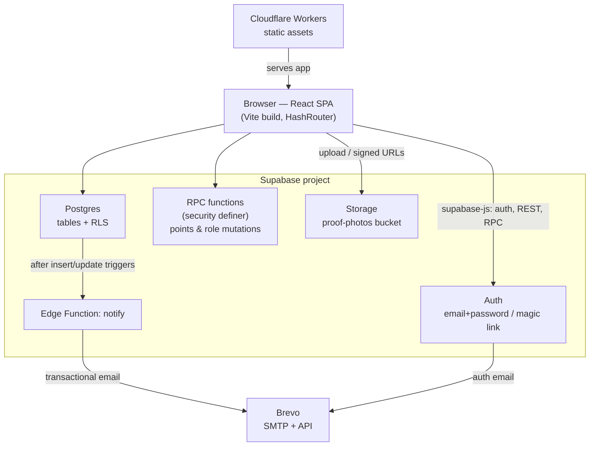

# Architecture

No custom backend server. The React SPA talks straight to Supabase; points
and approval logic live in Postgres functions so the browser can never write
a balance directly.

## Frontend

- **React 19 + Vite + TypeScript.** Tailwind is loaded from its CDN;
  Font Awesome for icons.
- **Branding.** The brand mark is static SVG in `public/` — `logo-mark.svg`
  (lotus only, also the favicon) and `logo.svg` (lotus + "Golden Lotus Healing
  Center" lockup) — rendered through one `components/Logo.tsx` component so the
  header, `Auth`, and `UpdatePassword` share a single source of truth. Favicon,
  `apple-touch-icon`, and the email banner (`logo-email.png`, a raster because
  mail clients don't render SVG) are generated from the same artwork. The app's
  display name is **GLHC Rewards**.
- **React Router in `HashRouter` mode** — routes live after a `#`
  (`/#/tasks`, `/#/rewards`, `/#/admin`, `/#/admin/history`). This keeps the
  static‑asset host from needing SPA rewrite rules.
- `App.tsx` holds the session and the signed‑in user's own data; it fetches
  the `profiles` row, active `tasks`, `rewards`, and the user's own
  `submissions` / `reward_claims`. Admin screens run their own wider queries.
- `services/supabaseClient.ts` creates the client from
  `VITE_SUPABASE_URL` / `VITE_SUPABASE_ANON_KEY` (build‑time env).
- `services/image.ts` compresses proof photos client‑side before upload.
- `services/authCallback.ts` handles the redirect back from magic / recovery
  links before the app mounts.

## Backend (Supabase)

- **Auth** — email/password (confirmation required) and magic link / OTP.
  A trigger mirrors every new `auth.users` row into `public.profiles`.
- **Postgres** — the relational core (see
  [Data Model and Security](Data-Model-and-Security.md)).
- **Row Level Security** on every table: a user sees/edits only their own
  rows; admins can read all submissions/claims/profiles.
- **RPC functions**, `security definer`, are the *only* path to
  `profiles.points` and `profiles.role`: `approve_submission`, `submit_task`,
  `request_reward`, `approve_reward_claim`, `send_reward`, `adjust_points`,
  `set_user_role`.
- **Storage** — private `proof-photos` bucket, one folder per user id. The app
  reads photos through short‑lived signed URLs.

## Email

Postgres `after insert/update` triggers on `submissions` and `reward_claims`
call the **`notify` Edge Function** with a shared secret; it looks up the
recipient and sends through the Brevo API. Auth email (magic link,
confirmation, reset) goes through Brevo SMTP configured on Supabase Auth.
Until a `private.email_config` row exists the triggers are silent no‑ops.
See [Email Notifications](Email-Notifications.md).

## Hosting & deploy

Cloudflare Workers Builds runs `npm run build` on every push to `main` (which
type‑checks first — see [Deployment](Deployment.md)) and uploads `dist/` as
static assets via `wrangler`. The Supabase schema and the `notify` function
are **not** part of that build and are deployed separately with the Supabase
CLI.
